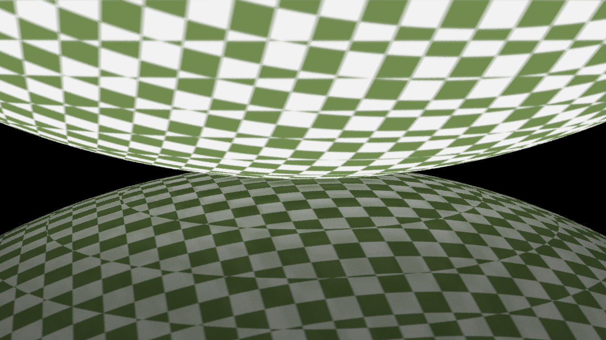
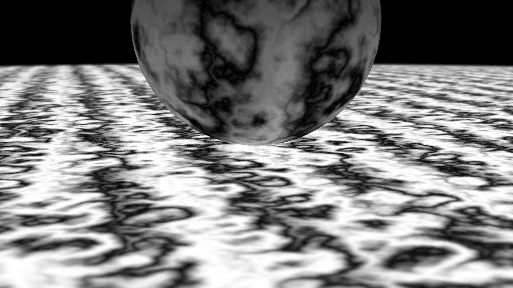

### *Ray Tracing in Two Weekends*

Fully-featured ray tracer written in Rust featuring naive multithreading based on [Rayon](https://github.com/rayon-rs/rayon).

It was made following [Steve Hollasch](https://github.com/hollasch)'s tutorials: *["Ray Tracing in One Weekend"](https://raytracing.github.io/books/RayTracingInOneWeekend.html)* and *["Ray Tracing: The Next Week"](https://raytracing.github.io/books/RayTracingTheNextWeek.html)*.

#### Example renders

| resolution  | rays per pixel  |
|:-----------:|:---------------:|
| 1280 x 720  |      1000       |

#### Finished functions

- [X] The `Vec3` class
- [X] Rays, a Simple Camera, and Background
- [X] Adding a Sphere
- [X] Output an Image (as PNG)
- [X] Adding an ETA Indicator
- [X] Surface Normals and Multiple Objects
- [X] Antialiasing
- [X] Diffuse Materials
- [X] Metal
- [X] Dielectrics
- [X] Positionable Camera
- [X] Defocus Blur
- [X] Motion Blur
- [X] Bounding Volume Hierarchies
- [X] Solid Textures
- [X] Perlin Noise
- [X] Image Texture Mapping
- [X] Rectangles and Lights
- [X] Instances
- [X] Volumes
